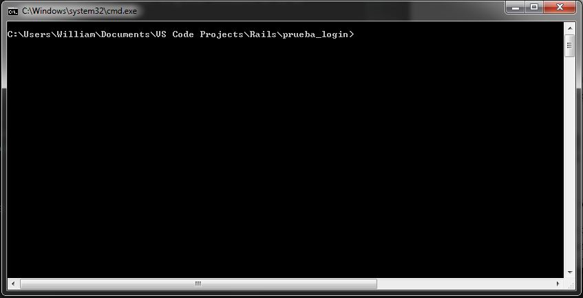
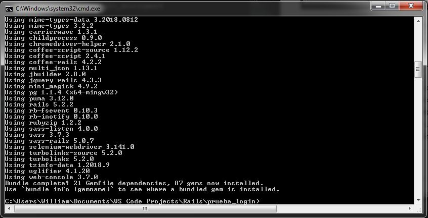
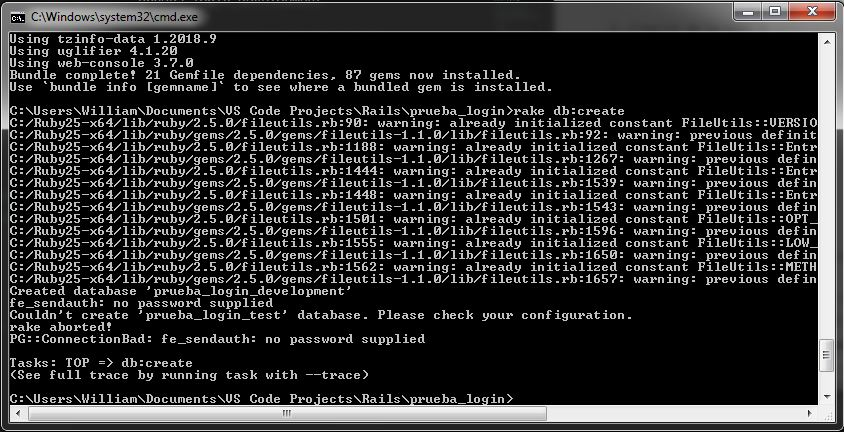
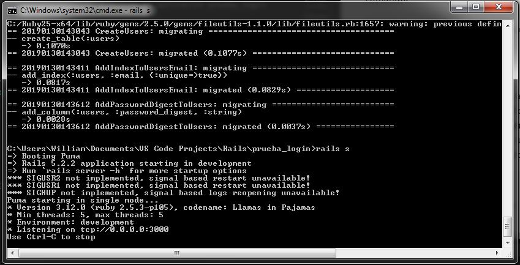
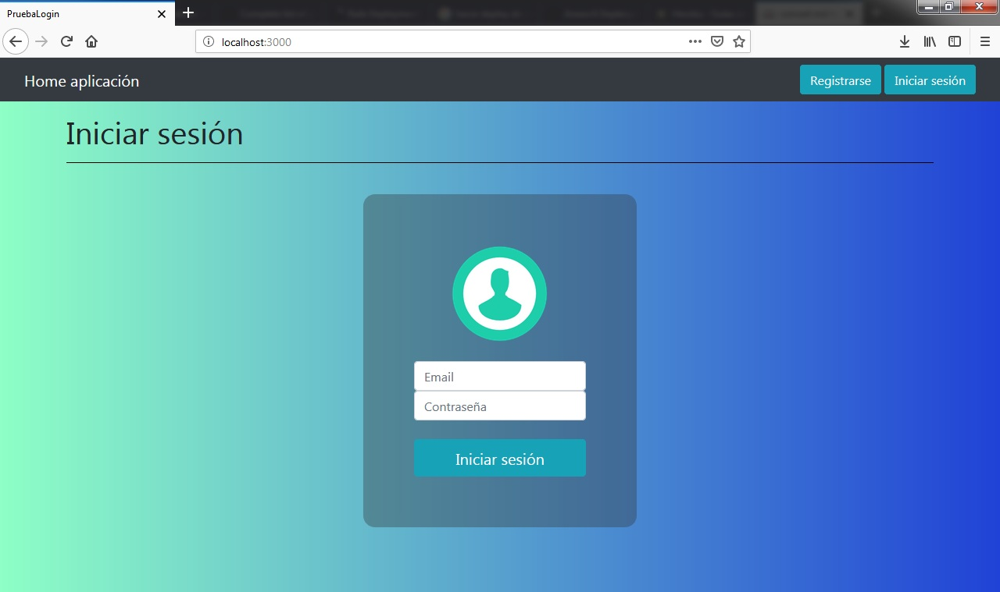

# Aplicación prueba login

En este repositorio encuentra una aplicación desarrollada en **RUBY ON RAILS**, siguiendo los requerimientos definidos en una prueba técnica de desarrollo web.

## Requerimientos :clipboard:

La aplicación debe:

* Almacenar el Email, nombres, apellidos, foto (avatar) e identificación de cada usuario.
* Permitir iniciar y cerrar sesión.
* Validar sesiones.
* Listar usuarios registrados.
* Mostrar información de los usuarios registrados.
* Registrar un nuevo usuario.
* Editar la información de los usuarios registrados.
* Eliminar los usuarios registrados.
* Validar formularios en front-end y back-end.
* Tener una interfaz gráfica agradable.

## Características de la aplicación :art:

Esta aplicación se desarrolló utilizando el framework de aplicaciones web **RUBY ON RAILS (RoR)**. **RoR** está escrito en el lenguaje de programación **Ruby** y se basa en la arquitectura de software Modelo Vista Controlador **(MVC)**. En **Ruby** es posible desarrollar utilizando paquetes de librerias conocidas como gemas, y para la aplicación se utilizaron las gemas 'bootstrap', 'carrierwave', 'mini_magick' y 'bcrypt'. La base de datos usada para esta aplicación es **PostgreSQL**.

<table style="display: table; width: 100%;">
    <tbody>
        <tr>
            <td style="width: 25%;">
                <div align="center">
                    <h2>Lenguaje</h2>
                    
                    <h4>Ruby v2.5.3</h4>
                </div>
            </td>
            <td style="width: 25%;">
                <div align="center">
                    <h2>Framework</h2>
                    
                    <h4>Ruby on Rails v5.2.2</h4>
                </div>
            </td>
            <td style="width: 25%;">
                <div align="center">
                    <h2>Gemas</h2>
                    
                    <h4>Bootstrap v4.0</h4>
                </div>
            </td>
            <td style="width: 25%;">
                <div align="center">
                    <h2>Base de datos</h2>
                    
                    <h4>PostgreSQL v9.6</h4>
                </div>
            </td>
        </tr>
    </tbody>
</table>

## Despliegue en máquina local 🚀

Para realizar el despliegue de forma local y en un ambiente de **desarrollo** se deben seguir las siguientes instrucciones:

### Pre-requisitos de software

Para desplegar la aplicación de forma local se debe tener instalado:

* [Ruby](https://rubyinstaller.org/downloads/) - Instalador de Ruby para Windows
* [Ruby on Rails](https://guides.rubyonrails.org/getting_started.html#installing-rails) - Guía de instalación Rails
* [Bundler](https://bundler.io/#getting-started) - Guía de instalación Bundler
* [PostgreSQL](https://www.postgresql.org/download/) - Instaladores de PostgreSQL

### Pre-requisitos de la base de datos

Antes de hacer el despliegue de la aplicación se debe configurar el archivo **database.yml** que está en la ruta _**prueba_login\config\database.yml**_. En este archivo se debe agregar la información de usuario y contraseña para la conexión con la base de datos.

```
development:
  <<: *default
  database: prueba_login_development
  
  ...

  username: #Ingresar USERNAME de la BD
  password: #Ingresar PASSWORD de la BD
  
  ...
```

### Despliegue

Una vez se tenga el directorio de la aplicación en la maquina local, se debe abrir una terminal de comandos o Command prompt con la ubicación aplicación.

<div align="center">
    
</div><br>

En esta ubicación se deben ejecutar los comandos:

```
1. Instalación de gemas especificadas en el archivo Gemfile

...\prueba_login> bundle install
```
<div align="center">
    
</div><br>

```
2. Creación de la base de datos prueba_login_development

...\prueba_login> rake db:create
```

<div align="center">
    
</div><br>

```
3. Migracíon de la base de datos

...\prueba_login> rake db:migrate
```

<div align="center">
    
</div><br>

Después de crear y migrar la base de datos es posible ejecutar la aplicación, para esto se utiliza el siguiente comando:

```
4. Ejecutar la aplicación prueba_login

...\prueba_login> rails s
```

<div align="center">
    
</div><br>


Ahora se debe abrir la ruta ***http://localhost:3000/*** en algún navegador web y se podra utilizar la aplicación.

<div align="center">
    
</div><br>

## Despliegue en Heroku 🚀

Heroku es un servicio que permite desplegar aplicaciones desarrolladas en Ruby, Java, Node.js o Python en Internet sin tener que configurar el servidor, instalar programas o configurar la base de datos. Heroku usa el Gestor de Base de Datos PostgreSQL.

Para hacer uso de Heroku, primero se debe crear una cuenta en [su sitio](https://www.heroku.com/).

### Heroku CLI

Posterior a la creacióin de la cuenta en Heroku, se debe descargar e instalar el [Heroku CLI](https://devcenter.heroku.com/articles/heroku-cli#download-and-install). Esta aplicación permite interactuar con Heroku mediante la línea de comando.

Cuando se haya instalado Heroku CLI, ejecutar el comando ***heroku login*** para realizar la autenticación con el email y contraseña de la cuenta Heroku.

### Despliegue

Antes de desplegar la aplicación en Heroku, se debe crear la aplicación ejecutando el comando:

```
1. Creación de la aplicación en el servidor de Heroku

...\prueba_login> heroku create
```

Para desplegar la aplicación a Heroku, se debe usar Git:

```
2. Desplegar aplicación a Heroku

...\prueba_login> git push heroku master
```

Se debe generar la Base de Datos de la aplicación realizando una migración:

```
3. Generar base de datos de la aplicación en Heroku

...\prueba_login> heroku run rake db:migrate
```

Por último se ejecuta el comando para desplegar la aplicación:

```
4. Desplegar aplicación en Heroku

...\prueba_login> heroku open
```

## Autor ✒️

 **William Avila** - *Desarrollo y documentación* - [00william](https://github.com/00william)


